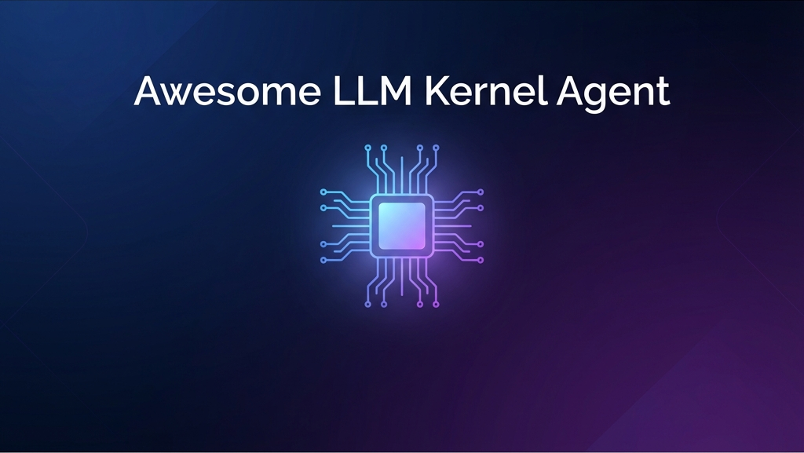

<div align="center">



# 🚀 Awesome LLM Kernel Agent

### *A Curated Collection of LLM-Driven GPU Kernel Generation & Optimization Research*

[](https://awesome.re)
[](https://github.com/qhy991/Awsome-LLM-Kernel-Agent)
[](#)
[](CONTRIBUTING.md)

[📖 Introduction](#-introduction) • [📚 Papers](#-research-papers) • [🎯 Benchmarks](#-datasets-and-benchmarks) • [🛠️ Resources](#-traditional-kernel-optimization) • [🤝 Contributing](#-contributing)

</div>

---

## 📖 Introduction

Welcome to **Awesome LLM Kernel Agent** – a comprehensive collection of cutting-edge research on using Large Language Models (LLMs) for GPU kernel generation and optimization. This repository tracks the rapidly evolving field where AI meets high-performance computing.

### 🎯 What is LLM-Based Kernel Generation?

GPU kernel programming (CUDA, Triton, HIP, etc.) requires deep expertise in parallel computing, memory hierarchies, and hardware architectures. Recent advances in LLMs have opened new possibilities for **automating kernel development** through:

- 🤖 **Agentic Systems**: Multi-agent frameworks that iteratively design, optimize, and verify kernels
- 🎓 **Reinforcement Learning**: Training models to discover optimal kernel implementations
- 🔧 **Fine-tuning**: Specialized models trained on kernel code datasets
- 🔄 **Iterative Optimization**: Feedback-driven refinement using profiling and benchmarking

### 👥 Who Should Use This?

- **Researchers** exploring AI for systems and HPC
- **ML Engineers** optimizing deep learning workloads
- **GPU Developers** interested in automated kernel generation
- **Students** learning about the intersection of AI and computer architecture

### 📊 Repository Statistics

- **Total Papers**: 63+
- **Latest Addition**: December 2025
- **Coverage**: CUDA, Triton, HIP, Metal, NPU, TPU
- **Approaches**: Agent-based, RL, Fine-tuning, RAG, Prompt Engineering

---

## 📚 Research Papers

### 🤖 LLM-Based Kernel Generation Methods

> This section covers methods that use LLMs to automatically generate and optimize GPU kernels across various platforms.

<details open>
<summary><b>📋 View All Methods (29 papers)</b></summary>

|  Title  |   Venue  |   Date   |   Code   |   First Author   |   Last Author   |   Affiliation   |   Topics   |
|:--------|:--------:|:--------:|:--------:|:--------:|:--------:|:--------:|:--------:|
|  [**CUDA-L2: Surpassing cuBLAS Performance for Matrix Multiplication through Reinforcement Learning**](https://arxiv.org/abs/2512.02551) | arXiv | 2025-12 | [GitHub](https://github.com/deepreinforce-ai/CUDA-L2) | Songqiao Su | Chris Shum | DeepReinforce Team | `CUDA` `RL` `HGEMM` `Matrix-Multiplication` |
| [**QiMeng-Kernel: Macro-Thinking Micro-Coding Paradigm for LLM-Based High-Performance GPU Kernel Generation**](https://arxiv.org/abs/2511.20100) | arXiv | 2025-11 | - | Xinguo Zhu | Ling Li | Intelligent Software Research Center, Institute of Software, CAS; State Key Lab of Processors, Institute of Computing Technology, CAS; Hangzhou Institute for Advanced Study, UCAS | `CUDA` `Triton` `RL` `Hierarchical` `MTMC` |
| [**KernelBand: Boosting LLM-based Kernel Optimization with a Hierarchical and Hardware-aware Multi-armed Bandit**](https://arxiv.org/abs/2511.18868) | arXiv | 2025-11 | - | Dezhi Ran | Tao Xie | Key Lab of HCST (PKU), MOE; SCS, Peking University; East China Normal University; Department of Computer Science, Tianjin University; Simon Fraser University; School of Computer Science & Technology, Beijing Jiaotong University; Hong Kong University of Science and Technology| `Triton` `Multi-Armed-Bandit` `Hardware-Aware` `Agent` |
| [**KForge: Program Synthesis for Diverse AI Hardware Accelerators**](https://arxiv.org/abs/2511.13274) | arXiv | 2025-11 | - | Taras Sereda | Zain Asgar | Gimlet Labs, San Francisco;Department of Electrical Engineering, Stanford University; Department of Computer Science, Stanford University| `CUDA` `Metal` `Multi-Agent` `Cross-Platform` |
| [**KernelFalcon: Autonomous GPU Kernel Generation via Deep Agents**](https://pytorch.org/blog/kernelfalcon-autonomous-gpu-kernel-generation-via-deep-agents/) | PyTorch Blog | 2025-11 | [GitHub](https://github.com/meta-pytorch/KernelAgent) | - | - | meta-pytorch | `Triton` `Deep-Agent` `Multi-Agent` `Verification` |
| [**CudaForge: An Agent Framework with Hardware Feedback for CUDA Kernel Optimization**](https://arxiv.org/abs/2511.01884) | arXiv | 2025-11 | [GitHub](https://github.com/OptimAI-Lab/CudaForge) | Zijian Zhang | Caiwen Ding | University of Minnesota, Twin Cities | `CUDA` `Agent` `Iterative-Search` |
| [**STARK: Strategic Team of Agents for Refining Kernels**](https://arxiv.org/abs/2510.16996) | arXiv | 2025-10 | - | Juncheng Dong | Shuang Yang |Meta Ranking AI Research, Duke University  | `CUDA` `Multi-Agent` `Iterative-Search` |
| [**TritonRL: Training LLMs to Think and Code Triton Without Cheating**](https://arxiv.org/abs/2510.17891) | arXiv | 2025-10 | [OpenReview](https://openreview.net/forum?id=oaKd1fVgWc) | Jiin Woo | Youngsuk Park |Carnegie Mellon University; Amazon Web Services | `Triton` `RL` `Fine-tuning` `Reward-Hacking-Prevention` |
| [**From Large to Small: Transferring CUDA Optimization Expertise via Reasoning Graph**](https://arxiv.org/abs/2510.19873) | arXiv | 2025-10 | - | Junfeng Gong | Huawei Li |  Institute of Computing Technology, Chinese Academy of Sciences; UCAS; South China University of Technology | `CUDA` `RAG` `Transfer-Learning` |
| [**ConCuR: Conciseness Makes State-of-the-Art Kernel Generation**](https://arxiv.org/abs/2510.07356) | arXiv | 2025-10 | - | Lingcheng Kong | Huan Wang |The Hong Kong University of Science and Technology; Zhejiang University, University of Cambridge, Westlake University  | `CUDA` `Fine-tuning` |
| [**Mastering Sparse CUDA Generation through Pretrained Models and Deep Reinforcement Learning**](https://openreview.net/forum?id=VdLEaGPYWT) | ICLR 2026 | 2025-09 | - | - | - | Autonomous | `CUDA` `Sparse` `RL` `Fine-tuning` |
| [**Towards Robust Agentic CUDA Kernel Benchmarking, Verification, and Optimization**](https://arxiv.org/abs/2509.14279) | arXiv | 2025-09 | [GitHub](https://github.com/SakanaAI/robust-kbench) | Robert Tjarko Lange | David Ha |Sakana AI| `CUDA` `Benchmarking` `Verification` |
| [**Astra: A Multi-Agent System for GPU Kernel Performance Optimization**](https://arxiv.org/abs/2509.07506) | arXiv | 2025-09 | - | Anjiang Wei | Alex Aiken |  Stanford University / Shanghai Jiao Tong University / Nanjing University | `CUDA` `Multi-Agent` |
| [**SwizzlePerf: Hardware-Aware LLMs for GPU Kernel Performance Optimization**](https://arxiv.org/abs/2508.20258) | arXiv | 2025-08 | - | Arya Tschand | Vijay Janapa Reddi |Harvard University / AMD / Stanford University | `AMD-GPU` `Hardware-Aware` |
| [**CudaLLM: Training Language Models to Generate High-Performance CUDA Kernels**](https://huggingface.co/ByteDance-Seed/cudaLLM-8B) | HuggingFace | 2025-08 | [GitHub](https://github.com/ByteDance-Seed/cudaLLM) | - | - |  ByteDance-Seed  | `CUDA` `Fine-tuning` |
|  [**GEAK: Introducing Triton Kernel AI Agent & Evaluation Benchmarks**](https://arxiv.org/abs/2507.23194) | arXiv | 2025-07 | [GitHub](https://github.com/AMD-AIG-AIMA/GEAK-agent) | Jianghui Wang | Emad Barsoum |AMD | `Triton` `AMD` `Iterative-Search` |
|  [**AutoTriton: Automatic Triton Programming with Reinforcement Learning in LLMs**](https://arxiv.org/abs/2507.05687) | arXiv | 2025-07 | [GitHub](https://github.com/AI9Stars/AutoTriton) • [🤗 Model](https://huggingface.co/ai9stars/AutoTriton) | Shangzhan Li | Maosong Sun | Tsinghua University / Harbin Institute of Technology / Tianjin University / OpenBMB| `Triton` `Fine-tuning` `RL` |
|  [**CUDA-L1: Improving CUDA Optimization via Contrastive Reinforcement Learning**](https://arxiv.org/abs/2507.14111) | arXiv | 2025-07 | [GitHub](https://github.com/deepreinforce-ai/CUDA-L1) | Xiaoya Li | Chris Shum |  DeepReinforce Team | `CUDA` `Fine-tuning` `RL` |
| [**KernelLLM: Making Kernel Development More Accessible**](https://huggingface.co/facebook/KernelLLM) | HuggingFace | 2025-06 | [🤗 Model](https://huggingface.co/facebook/KernelLLM) | - | - | meta| `Triton` `Fine-tuning` `SFT` |
| [**Omniwise: Predicting GPU Kernels Performance with LLMs**](https://arxiv.org/abs/2506.20886) | arXiv | 2025-06 | - | Zixian Wang | Keith Lowery | University of Illinois Urbana-Champaign / AMD | `AMD-NPU` `Surrogate-Modeling` |
| [**Kevin: Multi-Turn RL for Generating CUDA Kernels**](https://openreview.net/forum?id=HLeyRyV55o) | EXAIT @ ICML | 2025-06 | - | - | - | Autonomous | `CUDA` `Fine-tuning` `RL` |
| [**GPU Kernel Scientist: An LLM-Driven Framework for Iterative Kernel Optimization**](https://openreview.net/forum?id=K4XSvet59a) | ES-FoMo @ ICML | 2025-06 | - | - | - | Autonomous| `AMD` `Iterative-Search` |
| [**CUDA-LLM: LLMs Can Write Efficient CUDA Kernels**](https://arxiv.org/abs/2506.09092) | arXiv | 2025-06 | - | Wentao Chen | An Zou |Shanghai Jiao Tong University | `CUDA` `Prompt-Engineering` |
| [**The AI CUDA Engineer: Agentic CUDA Kernel Discovery, Optimization and Composition**](https://pub.sakana.ai/ai-cuda-engineer) | Sakana AI | 2025-02 | [🤗 Dataset](https://huggingface.co/datasets/SakanaAI/AI-CUDA-Engineer-Archive) | - | - | Sakana AI | `CUDA` `Agent` `Iterative-Search` `RAG` |

</details>

---

### 🧠 Agent Methodology & Techniques

> General agentic and reasoning techniques applicable to kernel generation and systems optimization.

|  Title  |   Venue  |   Date   |   Code   |   First Author   |   Affiliation   |   Topics   |
|:--------|:--------:|:--------:|:--------:|:--------:|:--------:|:--------:|
| [**OS-R1: Agentic Operating System Kernel Tuning with Reinforcement Learning**](https://arxiv.org/abs/2508.12551) | arXiv | 2025-08 | - | Hongyu Lin | - | `OS-Kernel` `RL` `Agent` |
| [**GEPA: Reflective Prompt Evolution Can Outperform Reinforcement Learning**](https://arxiv.org/abs/2507.19457) | arXiv | 2025-07 | - | Lakshya A Agrawal | - | `Prompt-Engineering` `Reflective-Evolution` |
| [**AlphaEvolve: A Coding Agent for Scientific and Algorithmic Discovery**](https://arxiv.org/abs/2506.13131) | arXiv | 2025-06 | - | Alexander Novikov | - | `Coding-Agent` `Scientific-Discovery` |

---

### 📊 Datasets and Benchmarks

> Evaluation benchmarks and datasets for assessing LLM-generated kernel quality and performance.

|  Title  |   Venue  |   Date   |   Code   |   First Author   |   Affiliation   |   Platforms   |
|:--------|:--------:|:--------:|:--------:|:--------:|:--------:|:--------:|
|  [**MultiKernelBench: A Multi-Platform Benchmark for Kernel Generation**](https://www.arxiv.org/abs/2507.17773) | arXiv | 2025-07 | [GitHub](https://github.com/wzzll123/MultiKernelBench) | Zhongzhen Wen | - | `CUDA` `CANN` `TPU` |
| [**NPUEval: Optimizing NPU Kernels with LLMs and Open Source Compilers**](https://arxiv.org/abs/2507.14403) | arXiv | 2025-07 | - | Sarunas Kalade | - | `NPU` |
| [**KernelBook: PyTorch to Triton Code Translation Dataset**](https://huggingface.co/datasets/GPUMODE/KernelBook) | HuggingFace | 2025-05 | [🤗 Dataset](https://huggingface.co/datasets/GPUMODE/KernelBook) | - | - | `Triton` `PyTorch` |
|  [**TritonBench: Benchmarking Large Language Model Capabilities for Generating Triton Operators**](https://arxiv.org/abs/2502.14752) | ICML 2025 | 2025-02 | [GitHub](https://github.com/thunlp/TritonBench) • [🤗 Dataset](https://huggingface.co/collections/LiShangZ/tritonbench) | Jianling Li | - | `Triton` `CUDA` |
|  [**KernelBench: Can LLMs Write Efficient GPU Kernels?**](https://arxiv.org/abs/2502.10517) | ICML 2025 | 2025-02 | [GitHub](https://github.com/ScalingIntelligence/KernelBench) | Anne Ouyang | - | `CUDA` |
| [**EquiBench: Benchmarking Code Reasoning Capabilities of Large Language Models via Equivalence Checking**](https://arxiv.org/abs/2502.12466) | arXiv | 2025-02 | - | Anjiang Wei | - | `Code-Reasoning` |
| [**Comparing Llama-2 and GPT-3 LLMs for HPC kernels generation**](https://arxiv.org/abs/2309.07103) | LCPC 2023 | 2023-09 | - | Pedro Valero-Lara | - | `HPC` |

---

### 🛠️ Traditional Kernel Optimization

> Manual kernel optimization techniques, DSLs, and educational resources for understanding GPU programming fundamentals.

|  Title  |   Date   |   Topics & Resources   |
|:--------|:--------:|:--------:|
| [**CuTe — NVIDIA CUTLASS Documentation**](https://docs.nvidia.com/cutlass/latest/media/docs/cpp/cute/index.html) | 2025-12 | `CUDA` `Layout` `Tensor` `Library` |
| [**NineToothed: A DSL based on Triton**](https://github.com/InfiniTensor/ninetoothed) | 2025 | `Triton` `DSL` • [GitHub](https://github.com/InfiniTensor/ninetoothed) |
| [**Helion: A Python-embedded DSL for ML Kernels**](https://github.com/pytorch/helion) | 2025 | `PyTorch` `DSL` • [GitHub](https://github.com/pytorch/helion) |
| [**HipKittens: Fast and Furious AMD Kernels**](https://arxiv.org/abs/2511.08083) | 2025-11 | `AMD-GPU` `HIP` • [GitHub](https://github.com/HazyResearch/HipKittens) |
| [**FlashMoBA: Optimizing Mixture of Block Attention**](https://arxiv.org/abs/2511.11571) | 2025-11 | `CUDA` `Attention` `Sparse` • [GitHub](https://github.com/mit-han-lab/flash-moba) |
| [**TileLang: A Compiler for Tile-Based Accelerators**](https://arxiv.org/abs/2504.17577) | 2025-04 | `DSL` `Compiler` • [GitHub](https://github.com/tile-ai/tilelang) |
| [**Can Tensor Cores Benefit Memory-Bound Kernels? (No!)**](https://arxiv.org/abs/2502.16851) | 2025-02 | `Tensor-Core` `Memory-Bound` `Analysis` |
| [**ThunderKittens: A DSL for High-Performance Tensor Computations**](https://arxiv.org/abs/2410.20399) | 2024-10 | `CUDA` `Tensor-Core` `DSL` • [GitHub](https://github.com/HazyResearch/ThunderKittens) |
| [**How To Write A Fast Matrix Multiplication From Scratch With Tensor Cores**](https://alexarmbr.github.io/2024/08/10/How-To-Write-A-Fast-Matrix-Multiplication-From-Scratch-With-Tensor-Cores.html) | 2024-08 | `Tutorial` `Tensor-Core` `GEMM` |
| [**Tensor Kernels (TK)**](https://hazyresearch.stanford.edu/blog/2024-05-12-tk) | 2024-05 | `Blog` `Tensor-Core` `Optimization` |
| [**CUDA Matrix Multiplication**](https://siboehm.com/articles/22/CUDA-MMM) | 2022-06 | `Tutorial` `CUDA` `GEMM` |

---

## 🌟 Community & Resources

### 📰 Industry Blogs & News

|  Title  |   Date   |   Topics   |
|:--------|:--------:|:--------:|
| [**Automating GPU Kernel Generation with DeepSeek-R1 and Inference Time Scaling**](https://developer.nvidia.com/blog/automating-gpu-kernel-generation-with-deepseek-r1-and-inference-time-scaling/) | 2025 | `NVIDIA` `DeepSeek-R1` `CUDA` |

### 🏆 Competitions & Challenges

|  Event  |   Date   |   Platform   |
|:--------|:--------:|:--------:|
| [AMD Developer Challenge 2025](https://www.datamonsters.com/amd-developer-challenge-2025) | 2025-04 | `AMD-GPU` |
| [GPU Mode Leaderboard](https://www.gpumode.com/) | Ongoing | `AMD` `CUDA` |

---

## 🤝 Contributing

We welcome contributions! If you know of a paper, tool, or resource that should be included, please:

1. **Fork** this repository
2. **Add** your entry following the existing format
3. **Submit** a pull request with a brief description

### Contribution Guidelines

- Ensure the paper/resource is relevant to LLM-based kernel generation or GPU optimization
- Include proper citation with title, venue, date, and links
- Add appropriate topic tags
- Maintain chronological order (newest first)
- Check for duplicates before submitting

---

## 📄 Citation

If you find this repository useful for your research, please consider citing:

```bibtex
@misc{awesome-llm-kernel-agent,
  author = {Haiyan Qin},
  title = {Awesome LLM Kernel Agent: A Curated Collection of LLM-Driven GPU Kernel Generation Research},
  year = {2025},
  publisher = {GitHub},
  url = {https://github.com/qhy991/Awsome-LLM-Kernel-Agent}
}
```

---

## 📜 License

[](https://creativecommons.org/publicdomain/zero/1.0/)

This work is licensed under a [Creative Commons Zero v1.0 Universal](LICENSE) license.

---

<div align="center">

**⭐ If you find this repository helpful, please consider giving it a star! ⭐**

Maintained with ❤️ by the community

*Last Updated: December 2025*

</div>